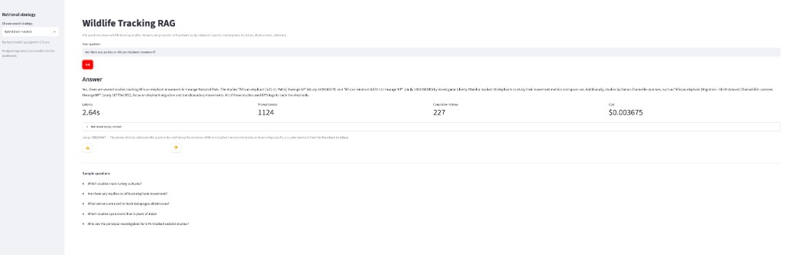
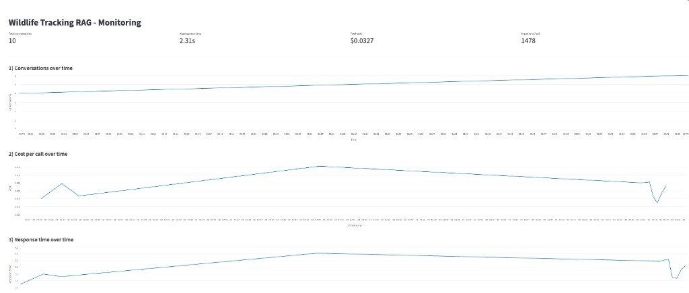

# Wildlife Tracking RAG

Retrieval-augmented generation (RAG) assistant that answers questions about wildlife tracking studies (species, locations, sensors, investigators, time periods, citations) grounded in **[Movebank](https://www.movebank.org)** study metadata.

Ask things like:

- *Which studies track turkey vultures?*
- *Are there any studies on African elephant movement corridors?*
- *What sensors are used to track Galapagos albatrosses?*
- *Who is the principal investigator for the Serengeti lion project?*
- *Which studies span more than 5 years of data?*

The assistant retrieves relevant Movebank studies from an indexed knowledge base and answers with study names + study IDs. It refuses to answer (`"I don't know..."`) when the corpus does not cover the question.

---

## Contents

- [Problem statement](#problem-statement)
- [Evaluation criteria mapping](#evaluation-criteria-mapping)
- [Architecture](#architecture)
- [Quick start (Docker Compose)](#quick-start-docker-compose)
- [Environment variables](#environment-variables)
- [Example usage](#example-usage)
- [Screenshots](#screenshots)
- [How it works](#how-it-works)
  - [Ingestion pipeline (dlt)](#ingestion-pipeline-dlt)
  - [Retrieval strategies](#retrieval-strategies)
  - [Evaluation](#evaluation)
  - [Monitoring dashboard](#monitoring-dashboard)
- [Repo layout](#repo-layout)
- [Makefile reference](#makefile-reference)

---

## Problem statement

Movebank is the largest open repository of animal tracking data (GPS, accelerometer, ARGOS, geolocator, ...), hosted by the Max Planck Institute of Animal Behavior. Researchers upload studies documenting who tracked what species, where, when, and with which sensors — plus citations and licensing.

Discovering the *right* study for a research question is hard: the metadata is spread across thousands of studies. This project builds a RAG assistant over the study metadata so a biologist, journalist, or student can ask natural-language questions and get grounded answers with study IDs and citations.

The knowledge base is study metadata, **not** raw GPS fixes (which are billions of rows and rarely helpful as unstructured context). Each Movebank study is represented as one searchable document containing name, taxa, PI, contact, location, time period, animal/tag counts, sensors, objective, citation, license, and acknowledgements.

---

## Evaluation criteria mapping

Each criterion and where to find it in this repo:

| Criterion | Where to look |
| --- | --- |
| Problem description | [Problem statement](#problem-statement) |
| Retrieval flow (knowledge base + LLM) | [Architecture](#architecture), [Retrieval strategies](#retrieval-strategies) |
| Retrieval evaluation | [Evaluation → Retrieval evaluation](#evaluation) — 4 strategies compared in [`data/retrieval_eval.csv`](data/retrieval_eval.csv) |
| LLM evaluation | [Evaluation → LLM evaluation](#evaluation) — 2 prompts compared via LLM-as-judge in [`notebooks/03-llm-eval.ipynb`](notebooks/03-llm-eval.ipynb) |
| Interface | [Screenshots](#screenshots) — Streamlit app (`app.py`) + CLI (`assistant.py`) |
| Ingestion pipeline | [Ingestion pipeline (dlt)](#ingestion-pipeline-dlt) — automated via `dlt` |
| Monitoring | [Monitoring dashboard](#monitoring-dashboard) — user feedback + 6-chart dashboard |
| Containerization | [Quick start (Docker Compose)](#quick-start-docker-compose) — everything in [`docker-compose.yaml`](docker-compose.yaml) |
| Reproducibility | [Quick start](#quick-start-docker-compose), [Environment variables](#environment-variables), [Makefile reference](#makefile-reference) |
| Best practices (hybrid search, reranking, query rewriting) | [Retrieval strategies](#retrieval-strategies) — all three implemented in [`search.py`](search.py) |

---

## Architecture

```
Movebank CSV ── scripts/download_movebank.py ─┐
                                              │
                                     data/raw/*.csv
                                              │
                              pipelines/movebank_pipeline.py  (dlt filesystem + read_csv)
                                              │
                                    DuckDB: movebank.studies
                                              │
                                          ingest.py
                                              │
              ┌───────────────────────────────┼─────────────────────────────┐
              │                               │                             │
     minsearch text index          sentence-transformers          documents.json
     (BM25-ish)                    embeddings (all-MiniLM-L6-v2)
              │                               │
              └───────────┐         ┌─────────┘
                          │         │
                       search.py: TextSearcher, VectorSearcher, HybridSearcher (RRF),
                                  RerankedSearcher (cross-encoder), RewritingSearcher (LLM)
                                              │
                                        assistant.py  ──►  RAGWithMetrics (metrics.py)
                                              │                   │
                                              │                   ▼
                                              │            Postgres (conversations,
                                              │             feedback + judge verdict)
                                              │                   │
                                              ▼                   ▼
                                          Streamlit             Streamlit
                                          app.py (chat)         dashboard.py (7 charts)
```

---

## Quick start (Docker Compose)

Everything (Postgres, Streamlit app, monitoring dashboard) comes up with one command.

```bash
cp .env.example .env
# edit .env and set OPENAI_API_KEY (or point OPENAI_BASE_URL)
```

**Optional: Movebank credentials (live data).** Sign up for a free account at [movebank.org](https://www.movebank.org/cms/movebank-registration) and add your credentials to `.env`:

```bash
MOVEBANK_USERNAME=your_username
MOVEBANK_PASSWORD=your_password
```

This is **not required** — if you skip it, the ingestion step below automatically falls back to the bundled sample dataset (curated studies in `data/movebank_studies.sample.json`), and everything still works out of the box.

Bootstrap the knowledge base, then bring everything up:

```bash
make install    # uv sync
make bootstrap  # sample data -> builds search + vector indexes (works without Movebank credentials)

# OR, for live Movebank data instead of the sample (needs the credentials above):
# make download pipeline index

make compose-up  # docker compose up --build
```

**Why two separate steps?** Data ingestion (fetching studies, building the text/vector search index) and running the app are intentionally decoupled:

- **`make install` + `make bootstrap`** (or `make download pipeline index`) run **on your host**, outside Docker. They fetch/prepare Movebank study data and build the three search-index artifacts under `data/index/` (`wildlife_documents.json`, `wildlife_index.pkl`, `wildlife_embeddings.npy`). This is a one-time (or on-demand) data step — you only need to re-run it when you want to refresh the corpus.
- **`make compose-up`** only builds and starts the containers (Postgres, `db-init`, `app`, `dashboard`). It does **not** build the index itself — the `app`/`dashboard` containers mount your host's `./data` folder directly (`volumes: - ./data:/app/data` in `docker-compose.yaml`), so they simply *read* whatever index files already exist on the host. If you skip the bootstrap step, `data/index/` won't exist and the app will fail on first use with a `FileNotFoundError`.

This split means you can rebuild/restart the containers as often as you like (e.g. to pick up code changes) without ever re-running the (slower) embedding step, and conversely refresh the corpus without needing to rebuild any Docker image.

Then open:

- App:       http://localhost:8501
- Dashboard: http://localhost:8502

To seed the dashboard with sample conversations (~15 real RAG calls across all strategies):

```bash
make compose-generate  # docker compose run --rm app uv run python generate_data.py
```

Tear down:

```bash
make compose-down  # docker compose down -v
```

---

## Environment variables

All configuration lives in `.env` (copy from [`.env.example`](.env.example)). Nothing here is required beyond `OPENAI_API_KEY` (or `OPENAI_BASE_URL` for a compatible provider) — everything else has a sane default.

See [`docs/environment-variables.md`](docs/environment-variables.md) for the full list of variables, defaults, and what each one does.

---

## Example usage

CLI:

```bash
uv run python assistant.py "Are there any studies on African elephant movement?"
```

```text
Q: Are there any studies on African elephant movement?
A: Yes, there is a study called "African Elephant Movements Kruger" (study 10800345).
This study used GPS tags to track 14 African elephants (Loxodonta africana) in Kruger
National Park between 2005 and 2012. The objective was to inform corridor and conflict
management.
```

A couple more sample questions the app can answer out of the box (bundled sample dataset):

| Question | Answer (summarized) |
| --- | --- |
| *Which studies track turkey vultures?* | "Turkey Vulture Acopian Center USA GPS" (study 10763606) — 34 vultures GPS-tracked 2003–2020 across North/South America. |
| *What sensors are used to track Galapagos albatrosses?* | GPS — from the "Galapagos Albatrosses" study (study 2911040). |
| *Who are the principal investigators for GPS-tracked seabird studies?* | Sebastian Cruz (albatrosses) and Yan Ropert-Coudert (Adelie penguins). |

If the corpus doesn't cover a question, the assistant explicitly says `"I don't know..."` instead of guessing — see the [chat UI screenshot](#screenshots) below for the full response format (answer + latency/token/cost + retrieved context + judge verdict).

---

## Screenshots

**Chat UI** (`app.py`, http://localhost:8501) — ask a question, pick a retrieval strategy, and get a grounded answer with citations, latency/token/cost metrics, and the retrieved study context on a successful RAG run:



**Monitoring dashboard** (`dashboard.py`, http://localhost:8502) — conversations, cost, and response time over time, plus judge/feedback breakdowns:



---

## How it works

The next four sections walk through the pipeline end to end: how studies get ingested and indexed, how a question is answered at retrieval time, how quality is measured, and how production usage is monitored.

### Ingestion pipeline (dlt)

Two-step, automated:

1. `scripts/download_movebank.py` — fetches public Movebank study metadata via the REST endpoint `https://www.movebank.org/movebank/service/direct-read?entity_type=study`. Writes CSV to `data/raw/` and JSON to `data/movebank_studies.json`. Falls back to the bundled `data/movebank_studies.sample.json` (12 well-known studies) if the endpoint requires credentials that aren't set.

   Optionally set `MOVEBANK_USERNAME` / `MOVEBANK_PASSWORD` in `.env` for authenticated access.

2. `pipelines/movebank_pipeline.py` — a **dlt** pipeline that reads any CSV under `data/raw/` (`dlt.sources.filesystem` + `read_csv`) and loads it into `data/movebank_pipeline.duckdb` under the `movebank.studies` table.

3. `ingest.py` reads the DuckDB output (or the JSON fallback), turns each study row into a canonical document, then builds:
   - `data/index/wildlife_index.pkl` — minsearch text index
   - `data/index/wildlife_embeddings.npy` — dense vectors from `sentence-transformers/all-MiniLM-L6-v2`
   - `data/index/wildlife_documents.json` — the source docs

To re-ingest end to end:

```bash
make download    # (or copy your own CSVs into data/raw/)
make pipeline    # dlt -> DuckDB
make index       # build search + embeddings artifacts
```

### Retrieval strategies

Implemented in [`search.py`](search.py) and selectable at runtime via the app sidebar or `RAG_STRATEGY` env var:

| Strategy                | What it does                                                                 |
| ---                     | ---                                                                          |
| `text`                  | minsearch text search with field boosts (name, taxa, objective)              |
| `vector`                | dense retrieval over sentence-transformers embeddings (cosine similarity)    |
| `hybrid`                | Reciprocal Rank Fusion (RRF) of `text` and `vector`                          |
| `hybrid_rerank`         | RRF, then cross-encoder rerank with `ms-marco-MiniLM-L-6-v2`                 |
| `hybrid_rerank_rewrite` | Add an LLM query-rewrite step (e.g. common name → scientific name)           |

`create_assistant()` (used by the CLI and the `RAG_STRATEGY` env var) defaults to `hybrid_rerank_rewrite` — the highest-accuracy option per the [retrieval evaluation](#evaluation) below. The Streamlit app's sidebar dropdown defaults to the lighter-weight `hybrid` instead (no rerank/rewrite, so no cross-encoder model to load and no extra LLM call), and lets you switch to `hybrid_rerank_rewrite` ("best") at any time.

### Evaluation

#### Retrieval evaluation (all strategies)

Ground truth is [`data/ground_truth.json`](data/ground_truth.json) (30 human-written questions, each with the gold Movebank `study_id`). Run:

```bash
uv run python scripts/eval_retrieval.py
```

Results committed at [`data/retrieval_eval.csv`](data/retrieval_eval.csv):

| Strategy                | Hit@1 | Hit@3 | Hit@5 | MRR   |
| ---                     | ---   | ---   | ---   | ---   |
| text                    | 0.967 | 0.967 | 1.000 | 0.975 |
| vector                  | 0.900 | 0.967 | 1.000 | 0.942 |
| hybrid                  | 0.967 | 1.000 | 1.000 | 0.978 |
| **hybrid_rerank**       | **1.000** | **1.000** | **1.000** | **1.000** |

`hybrid_rerank_rewrite` also runs when `OPENAI_API_KEY` is set; on this corpus it matches `hybrid_rerank` at MRR 1.0 while adding query normalization for common → scientific names, which is where it shines on paraphrased user queries.

#### LLM evaluation (multiple prompts)

Notebook: [`notebooks/03-llm-eval.ipynb`](notebooks/03-llm-eval.ipynb).

Compares two prompt variants on the same retrieval backend:

- **Prompt A** — concise, cite study id, refuse if not in context
- **Prompt B** — "helpful research librarian" style, cite study id in parentheses, refuse if not in context

Each answer is graded by [`judge.py`](judge.py) (LLM-as-judge) as `RELEVANT` / `PARTLY_RELEVANT` / `NON_RELEVANT`. The winning prompt is wired into `rag_helper.INSTRUCTIONS` for the app.

#### Ground-truth generation

[`notebooks/01-ground-truth.ipynb`](notebooks/01-ground-truth.ipynb) uses the LLM to expand every study into 5 synthetic questions. The committed [`data/ground_truth.json`](data/ground_truth.json) is a hand-curated version of the same idea, so the retrieval eval is reproducible **without an OpenAI key**.

### Monitoring dashboard

Every RAG call is written to Postgres by [`db_save.py`](db_save.py). The LLM judge verdict and user thumbs (from the app) go to a linked `feedback` table via [`db_feedback.py`](db_feedback.py).

`dashboard.py` (http://localhost:8502) renders **7 charts** on top of that:

1. Conversations over time (per hour)
2. Cost per call over time
3. Response time over time
4. Judge relevance distribution (bar)
5. User feedback thumbs up/down (metrics)
6. Retrieval strategy usage & average latency (table + bars)
7. Top asked questions (table)

Plus 4 headline KPIs at the top (total conversations, avg latency, total cost, avg tokens/call).

To seed it quickly with real data:

```bash
uv run python generate_data.py
```

---

## Repo layout

```
wildlife-tracking-rag/
├── assets/screenshots/           # README screenshots (app chat UI, dashboard)
├── docs/
│   └── environment-variables.md # Full env var reference (linked from README)
├── app.py                       # Streamlit chat UI
├── assistant.py                 # Factory: index + searcher + RAGWithMetrics
├── dashboard.py                 # Streamlit monitoring (7 charts)
├── db_init.py                   # Postgres schema
├── db_save.py / db_feedback.py  # Persist conversations + feedback
├── db_query.py                  # Read queries for the dashboard
├── generate_data.py             # Seed real RAG conversations for the dashboard
├── ingest.py                    # Build text + vector indexes from studies
├── judge.py                     # LLM-as-judge (RelevanceVerdict)
├── llmclient.py                 # OpenAI-compatible client (OpenAI / Ollama / custom)
├── metrics.py                   # RAGWithMetrics + LLMCallRecord + cost table
├── rag_helper.py                # RAGBase, PROMPT_TEMPLATE, format_study_doc
├── search.py                    # Text / Vector / Hybrid(RRF) / Rerank / Rewrite
├── data/
│   ├── movebank_studies.sample.json   # 12 curated public studies (bootstrap)
│   ├── ground_truth.json              # 30 hand-curated Q -> study_id pairs
│   └── retrieval_eval.csv             # Committed retrieval eval results
├── pipelines/movebank_pipeline.py     # dlt: filesystem CSV -> DuckDB
├── scripts/
│   ├── download_movebank.py           # Fetch studies from Movebank REST
│   └── eval_retrieval.py              # Runnable retrieval eval
├── notebooks/
│   ├── 01-ground-truth.ipynb          # LLM-generated ground truth
│   ├── 02-retrieval-eval.ipynb        # Interactive retrieval eval
│   └── 03-llm-eval.ipynb              # Prompt A/B eval with judge
├── Dockerfile
├── docker-compose.yaml                # postgres + db-init + app + dashboard
├── Makefile                           # bootstrap / download / pipeline / index / app / dashboard
├── pyproject.toml                     # pinned deps, python >=3.12
└── .env.example
```

---

## Makefile reference

| Target             | What it does                                                                                          |
| ---                | ---                                                                                                    |
| `make install`     | `uv sync` — installs all dependencies into `.venv`                                                     |
| `make download`     | Fetches up to 3000 live studies from the Movebank REST API into `data/raw/` (needs `MOVEBANK_USERNAME`/`PASSWORD` in `.env`, or falls back to the bundled sample) |
| `make pipeline`     | Runs the `dlt` pipeline, loading `data/raw/*.csv` into `data/movebank_pipeline.duckdb`                |
| `make index`        | Runs `ingest.py` — builds the text index, embeddings, and documents JSON under `data/index/`          |
| `make sample-data`  | Copies the bundled `data/movebank_studies.sample.json` to `data/movebank_studies.json` (no credentials needed) |
| `make bootstrap`    | `sample-data` + `index` — the quickest way to get a working knowledge base with zero setup             |
| `make db-init`      | Creates the Postgres schema (`db_init.py`). Requires Postgres already running and reachable via `POSTGRES_HOST`/`PORT` — e.g. `docker compose up -d postgres` |
| `make app`          | Runs the Streamlit chat UI locally on port 8501                                                        |
| `make dashboard`    | Runs the Streamlit monitoring dashboard locally on port 8502                                           |
| `make generate`     | Seeds the dashboard with sample RAG conversations (`generate_data.py`), run locally                    |
| `make compose-up`   | `docker compose up --build` — brings up Postgres + `db-init` + `app` + `dashboard` in containers       |
| `make compose-down` | `docker compose down -v` — tears down containers and volumes                                           |
| `make compose-generate` | Same as `make generate`, but run inside the `app` container via `docker compose run`               |
| `make clean`        | Removes `data/index/`, `data/raw/`, the DuckDB file, and `data/movebank_studies.json`                  |

CLI quick test (no UI, no Postgres needed):

```bash
uv run python assistant.py "Which studies track Yellowstone wolves?"
```

---

## Data attribution

Sample studies bundled in [`data/movebank_studies.sample.json`](data/movebank_studies.sample.json) are metadata about publicly published Movebank studies. Please cite the individual studies (via each study's `citation` field) and Movebank itself when using this data. See [Movebank's citation guidelines](https://www.movebank.org/cms/movebank-content/citation-guidelines).

---

## License

MIT — see [LICENSE](LICENSE).
